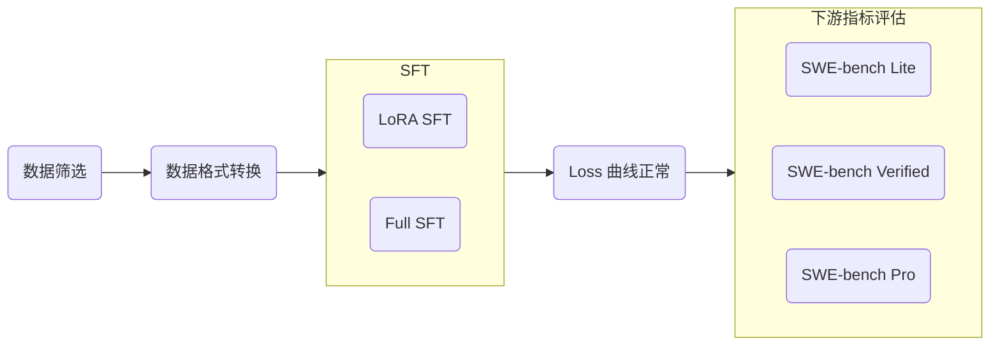

# SFT 用户手册

当前 SFT 主要依赖 [LlamaFactory](https://github.com/hiyouga/LlamaFactory) 进行，后续可能会切换到其他框架，但实验流程不变，如下图所示：



## 数据筛选

从 [开源数据集](https://docs.qq.com/sheet/DZG1HZGVUWnBEa1B1?tab=BB08J2)、自部署 GLM-5.2 等模型、产线数据等渠道获取高质量 Coding 与 Code Agent 数据。

## 数据格式转换

我们需要将筛选出来的数据转换为对应 SFT 框架支持的格式。以 LlamaFactory 为例，我们主要将数据转换为其支持的 [ShareGPT](https://llamafactory.readthedocs.io/zh-cn/latest/getting_started/data_preparation.html#id22) 格式：

```json
[
  {
    "conversations": [
      {
        "from": "human",
        "value": "人类指令"
      },
      {
        "from": "function_call",
        "value": "工具参数"
      },
      {
        "from": "observation",
        "value": "工具结果"
      },
      {
        "from": "gpt",
        "value": "模型回答"
      }
    ],
    "system": "系统提示词（选填）",
    "tools": "工具描述（选填）"
  }
]
```

注意：human 和 observation 必须出现在奇数位置，gpt 和 function 必须出现在偶数位置。

对于多轮对话任务，请参考 [parse_nemotron_v2_swe](../scripts/parse_nemotron_v2_swe.py) 中的代码实现，将一个包含多轮轨迹的训练样本拆分为多个训练样本。之后需要在训练配置文件中设置 `mask_history: true` 避免重复训练。

## SFT

安装 LlamaFactory：

```bash
# 安装 py3.12 开发工具包（针对 arm）
# 这一步需要在服务器上进行，因为 SSH 登陆时没有 sudo dnf 权限
sudo dnf install -y python3.12-devel

# 安装 uv
curl -LsSf https://astral.sh/uv/install.sh | sh

# 安装 LlamaFactory 及其依赖
git clone --depth 1 https://github.com/hiyouga/LlamaFactory.git
cd LlamaFactory
uv python pin 3.12
uv venv
source .venv/bin/activate
uv pip install -e .
uv pip install -r requirements/metrics.txt
uv pip install tensorboard

# (Optional) 安装 DeepSpeed 减小显存占用
# 若要启用，需要在配置文件中添加 deepspeed: examples/deepspeed/ds_z3_config.json
uv pip install -r requirements/deepspeed.txt

# (Optional) 安装 FA2 加速训推
# 若要启用，需要在配置文件中添加 flash_attn: fa2
uv pip install packaging psutil ninja
MAX_JOBS=4 uv pip install flash-attn --no-build-isolation -v

# (Optional) 安装 Liger 加速训练
# 若要启用，需要在配置文件中添加 enable_liger_kernel: true
uv pip install liger-kernel
```

### 数据配置

将转换后的 json 数据存储到 `LlamaFactory/data` 路径下，然后在 `LlamaFactory/data/dataset_info.json` 注册你的数据集。例如：

```json
{
  "nemotron_sft_swe_v2_agentless": {
    "file_name": "nemotron_sft_swe_v2_agentless.json",
    "formatting": "sharegpt",
    "columns": {
      "messages": "conversations"
    }
  },
  "nemotron_sft_swe_v2_swe_turns": {
    "file_name": "nemotron_sft_swe_v2_swe_turns.json",
    "formatting": "sharegpt",
    "columns": {
      "messages": "conversations",
      "system": "system",
      "tools": "tools"
    }
  }
}
```

### 训练配置

示例配置如下，参数含义详见 [LlamaFactory Docs](https://llamafactory.readthedocs.io/zh-cn/latest/advanced/arguments.html)，这里给一些基本的解释：

- 如果 `enable_thinking: false`，需要给 `template` 配置项添加 `_nothink` 后缀
- 参考 [statis_nemotron_v2](../scripts/statis_nemotron_v2.py) 的实现统计数据集的数据分布，选择合适的 `cutoff_len`

```bash
### model
model_name_or_path: /cpfs01/llm_team/models/Qwen3.5-35B-A3B
trust_remote_code: true

### method
stage: sft
do_train: true
finetuning_type: lora
lora_rank: 32
lora_alpha: 64
lora_dropout: 0.08
lora_target: q_proj,k_proj,v_proj,o_proj,in_proj_qkv,out_proj,gate_proj,up_proj,down_proj
loraplus_lr_ratio: 16.0
deepspeed: examples/deepspeed/ds_z3_config.json

### dataset
dataset: nemotron_sft_swe_v2_agentless
template: qwen3_5
enable_thinking: true
cutoff_len: 32768
max_samples: 10000
preprocessing_num_workers: 16
dataloader_num_workers: 4

### output
output_dir: saves/qwen3.5-35b-a3b/sft/lora-0723-agentless
logging_steps: 10
save_steps: 100
plot_loss: true
overwrite_output_dir: true
save_only_model: true
report_to: tensorboard

### train
enable_liger_kernel: true
per_device_train_batch_size: 4
gradient_accumulation_steps: 1
learning_rate: 2.0e-5
num_train_epochs: 2.0
lr_scheduler_type: cosine
warmup_ratio: 0.05
bf16: true
ddp_timeout: 180000000
resume_from_checkpoint: null
seed: 42

### eval
val_size: 0.03
per_device_eval_batch_size: 1
eval_strategy: steps
eval_steps: 100
```

启动微调：

```bash
export HF_HOME=.cache/huggingface
cd LlamaFactory

# 在 Agentless 数据上微调
OMP_NUM_THREADS=4 lmf train examples/train_lora/qwen3.5_lora_sft_nemov2_agentless.yaml

# 在 SWE 数据上微调
OMP_NUM_THREADS=4 lmf train examples/train_lora/qwen3.5_lora_sft_nemov2_swe.yaml
```

## 观察 Loss 曲线

```bash
tensorboard --logdir saves/qwen3.5-35b-a3b/sft/lora/runs/Jul21_17-43-57_gpu-node01-013
```

## 下游基准测试

### 部署 SFT 后的模型

全程使用 SGLang 官方 Docker 镜像部署模型，避免所有环境配置。示例配置如下：

```bash
docker run -d \
  --name sglang-local \
  --runtime nvidia \
  --gpus '"device=0,1,2,3"' \
  --platform linux/arm64 \
  -v /cpfs01/llm_team/dwj/data_filter/LlamaFactory/saves/qwen3.5-35b-a3b/sft/lora-0722-szy:/models \
  -v ~/.cache/huggingface:/root/.cache/huggingface \
  -p 8000:8000 \
  --ipc=host \
  lmsysorg/sglang:v0.5.11-cu130 \
  sglang serve \
    --model-path /models/lora_sft_merged \
    --served-model-name Qwen3.5-35B-A3B-agentless-sft-test \
    --host 0.0.0.0 \
    --port 8000 \
    --tp-size 4 \
    --allow-auto-truncate \
    --dtype bfloat16 \
    --mem-fraction-static 0.90 \
    --tool-call-parser qwen3_coder \
    --reasoning-parser qwen3 \
    --trust-remote-code
```

必须要修改的地方有：

- 首个数据挂载 `-v` 后的内容填写为你自己 SFT 后的模型权重路径。

`sglang serve` 启动参数中：

- `--model-path` 为挂载后的子路径。
- `--served-model-name` 可自定义。

### 启动 SWE-bench Lite 评估

目前仅 106 号 CPU 机器支持。

```bash
# 进入工作目录
cd /home/ubuntu/swebench
```

环境准备：

```bash
source /home/ubuntu/swebench/env.sh
cd /home/ubuntu/swebench/swebench-kit

# 把 <GPU_IP> 换成那台机器 IP，例如 10.0.3.49，确认能访问到
curl -sS http://<GPU_IP>:8000/v1/models
```

写配置 `/home/ubuntu/swebench/configs/<path/to/your_config.yaml>`：

```yaml
run:
  tag: <qwen35_a3b_lite75>  # 每次换新的 tag，目前无法覆盖相同 tag
  output_root: /home/ubuntu/swebench/swebench_runs
  dataset: lite75
  workers: 4
  max_passes: 3
  retry_empty: true
model:
  path: /dev/null
  served_name: <Qwen3.5-35B-A3B-agentless-sft-test>  # 必须和 --served-model-name 一致
sampling:
  temperature: 1.0
  top_p: 0.95
  top_k: 20
  repetition_penalty: 1.05
agent:
  step_limit: 250
environment:
  pull_timeout: 1800
serve:
  gpus: "0"
  manage: false
  endpoint: http://<GPU_IP>:8000/v1  # 修改为对应服务器的内网 IP
grade:
  enabled: true
  rolling: false
  max_workers: 4
  namespace: swebench
```

启动评估：

```bash
# 预览
./run.sh /home/ubuntu/swebench/configs/<path/to/your_config.yaml> --dry-run

# 正式后台跑
./run.sh </home/ubuntu/swebench/configs/<path/to/your_config.yaml> --detach
```

结果位置：

```text
/home/ubuntu/swebench/swebench_runs/<你的tag>/RESULT.txt
```
